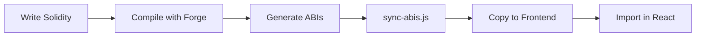

# Aero

> Modern Web3 dApp monorepo template with Next.js 16, React 19, and Foundry smart contracts.

A production-ready starter for building decentralized applications with the latest frontend technologies and Solidity development best practices.

---

## Features

- **Next.js 16** with React 19 and App Router
- **Tailwind CSS v4** with dark mode and OKLCH color system
- **Foundry** for blazing-fast smart contract development
- **TypeScript** end-to-end with strict type safety
- **shadcn/ui** component library (New York style)
- **pnpm workspaces** monorepo architecture
- **Docker** development environment with hot reload
- **Husky + lint-staged** for automated code quality

---

## Tech Stack

### Frontend
| Technology | Version | Purpose |
|------------|---------|---------|
| Next.js | 16.0.10 | React framework with App Router |
| React | 19.2.1 | UI library with Server Components |
| TypeScript | 5.7.3 | Type-safe JavaScript |
| Tailwind CSS | v4 | Utility-first CSS framework |
| shadcn/ui | Latest | Customizable component library |

### Smart Contracts
| Technology | Version | Purpose |
|------------|---------|---------|
| Foundry | Latest | Smart contract development toolkit |
| Solidity | ^0.8.13 | Contract programming language |
| Forge | Latest | Testing framework |
| Anvil | Latest | Local Ethereum node |

### Development Tools
| Tool | Purpose |
|------|---------|
| pnpm | Fast, efficient package manager |
| Husky | Git hooks automation |
| ESLint v9 | Code linting with flat config |
| Docker | Containerized development |

---

## Quick Start

### Prerequisites

- Node.js 20+
- pnpm 8+
- Foundry ([installation guide](https://book.getfoundry.sh/getting-started/installation))
- Docker (optional, for containerized development)

### Installation

```bash
# Clone the repository
git clone <repository-url>
cd aero

# Install dependencies
pnpm install

# Initialize Foundry submodules
cd foundry && forge install
```

### Development

```bash
# Start Next.js development server
pnpm dev

# Compile smart contracts
pnpm build:contracts

# Run contract tests
pnpm test

# Sync ABIs to frontend
pnpm sync-abis

# Start local Ethereum node
pnpm anvil
```

### Docker Development

```bash
# Start containerized environment
docker-compose up

# Rebuild and start
docker-compose up --build

# Stop containers
docker-compose down
```

---

## Project Structure

```
aero/
├── apps/
│   └── web/                    # Next.js frontend application
│       ├── app/                # App Router pages
│       ├── components/ui/      # shadcn/ui components
│       ├── lib/                # Utilities and contracts
│       └── public/             # Static assets
│
├── foundry/                    # Smart contract workspace
│   ├── src/                    # Solidity contracts
│   ├── test/                   # Forge tests
│   ├── script/                 # Deployment scripts
│   └── lib/                    # Contract dependencies
│
├── scripts/                    # Build and utility scripts
│   └── sync-abis.js            # ABI synchronization
│
├── docker-compose.yml          # Development orchestration
├── Dockerfile                  # Development container
└── Makefile                    # Alternative CLI commands
```

---

## Available Commands

### pnpm Scripts

| Command | Description |
|---------|-------------|
| `pnpm dev` | Start Next.js dev server on port 3000 |
| `pnpm build` | Build contracts and web application |
| `pnpm build:contracts` | Compile Solidity contracts |
| `pnpm build:web` | Build Next.js for production |
| `pnpm test` | Run Forge tests with verbose output |
| `pnpm anvil` | Start local Ethereum node |
| `pnpm sync-abis` | Copy ABIs from contracts to frontend |
| `pnpm lint` | Lint frontend code |
| `pnpm type-check` | Run TypeScript type checking |

### Makefile Commands

```bash
make dev          # Start development
make build        # Build contracts
make test         # Run tests
make sync-abis    # Sync ABIs
make clean        # Clean build artifacts
make help         # Show all commands
```

---

## Architecture

### Contract Integration Flow



1. Write contracts in `foundry/src/`
2. Compile: `pnpm build:contracts`
3. Sync: `pnpm sync-abis`
4. Import: `import ABI from '@/lib/contracts/Contract.json'`

> **Note**: ABIs in `apps/web/lib/contracts/` are build artifacts (gitignored). Always regenerate after contract changes.

### UI Component Pattern

Components use **shadcn/ui** copy-paste approach:

```bash
# Add new component
npx shadcn@latest add [component-name]

# Component is copied to components/ui/ (you own it)
# Customize freely without library constraints
```

### Styling Approach

Tailwind v4 uses CSS-first configuration:

- Theme tokens in `app/globals.css` via `@theme` directive
- OKLCH color space for perceptual uniformity
- Dark mode with class-based `.dark` selector
- Runtime theme switching via `next-themes`

---

## Development Workflow

### Adding a Smart Contract

```bash
# 1. Create contract
foundry/src/MyContract.sol

# 2. Write tests
foundry/test/MyContract.t.sol

# 3. Compile
pnpm build:contracts

# 4. Sync to frontend
pnpm sync-abis

# 5. Import in React
import MyContractABI from '@/lib/contracts/MyContract.json'
```

### Adding UI Components

```bash
# Add component via CLI
npx shadcn@latest add button

# Component appears in:
apps/web/components/ui/button.tsx

# Import and use:
import { Button } from '@/components/ui/button'
```

### Testing Contracts

```bash
# Run all tests
pnpm test

# Run specific test
cd foundry && forge test --match-test testFuzz_SetNumber

# Run with gas report
cd foundry && forge test --gas-report

# Run with verbose output
cd foundry && forge test -vvvv
```

---

## Configuration

### TypeScript Path Aliases

```typescript
// Use @/* to import from apps/web/
import { Button } from '@/components/ui/button'
import utils from '@/lib/utils'
import ABI from '@/lib/contracts/Counter.json'
```

### pnpm Workspace

```yaml
# pnpm-workspace.yaml
packages:
  - 'apps/**'
```

```ini
# .npmrc
node-linker=hoisted  # Docker-compatible mode
```

### Git Hooks

Pre-commit automatically runs:
- ESLint on changed TypeScript files
- Auto-fix where possible
- Blocks commit on unfixable errors

---

## Docker Configuration

### Development Container

- **Base**: Node.js 20 Alpine
- **Package Manager**: pnpm via Corepack
- **Hot Reload**: Source code mounted as volume
- **Port**: 3000 exposed for Next.js
- **Optimization**: Multi-layer caching for fast rebuilds

### Usage

```bash
# Start (builds automatically if needed)
docker-compose up

# Force rebuild
docker-compose up --build

# Run in background
docker-compose up -d

# View logs
docker-compose logs -f
```

---

## Contributing

### Code Quality

This project enforces code quality through:

- **ESLint v9**: Flat config with Next.js rules
- **TypeScript**: Strict mode enabled
- **Husky**: Pre-commit hooks
- **lint-staged**: Incremental linting

### Development Guidelines

1. Follow TypeScript strict mode
2. Use shadcn/ui components for consistency
3. Write tests for all smart contracts
4. Sync ABIs after contract changes
5. Keep components small and focused

---

## What's Included

### Implemented

- Complete monorepo structure
- Next.js 16 with React 19 and TypeScript
- Tailwind v4 with dark mode
- shadcn/ui component library
- Foundry smart contract environment
- Example Counter contract with tests
- ABI synchronization pipeline
- Docker development environment
- Git hooks for code quality

### Roadmap

- [ ] Web3 wallet integration (wagmi/viem)
- [ ] Contract interaction hooks
- [ ] Environment variable templates
- [ ] CI/CD pipeline
- [ ] Frontend testing framework
- [ ] Production Dockerfile
- [ ] Deployment documentation

---

## Troubleshooting

<details>
<summary><strong>"next: not found" in Docker</strong></summary>

Ensure `pnpm-workspace.yaml` and `.npmrc` are copied in Dockerfile:

```bash
docker-compose build --no-cache
docker-compose up
```
</details>

<details>
<summary><strong>ABIs not found in frontend</strong></summary>

ABIs are gitignored build artifacts. Regenerate them:

```bash
pnpm sync-abis
```
</details>

<details>
<summary><strong>Type errors after contract changes</strong></summary>

Sync ABIs and restart TypeScript server:

```bash
pnpm sync-abis
# Then restart TS server in your editor
```
</details>

<details>
<summary><strong>Pre-commit hook failing</strong></summary>

Fix ESLint errors manually or let auto-fix handle them:

```bash
pnpm lint
```
</details>

---

## License

[MIT](LICENSE)

---

## Resources

- [Next.js Documentation](https://nextjs.org/docs)
- [Foundry Book](https://book.getfoundry.sh/)
- [Tailwind CSS v4](https://tailwindcss.com/docs)
- [shadcn/ui](https://ui.shadcn.com/)
- [pnpm Documentation](https://pnpm.io/)

---

<div align="center">

**Built with modern tools for modern Web3 development**

[Report Bug](https://github.com/yourusername/aero/issues) · [Request Feature](https://github.com/yourusername/aero/issues)

</div>